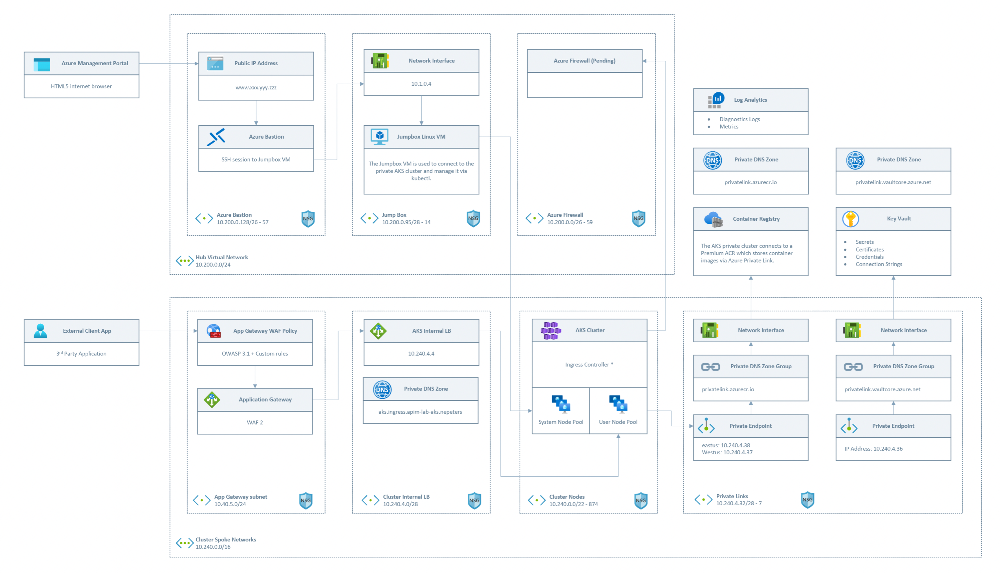

Bicep deployment for building a secure and scalable AKS clusters with the intention of hositng OpenAI integrated applications.

Based on the AKS best practices found in the Microsoft AKS Baseline ([documentaton](https://learn.microsoft.com/en-us/azure/architecture/reference-architectures/containers/aks/baseline-aks)).

## Prepare Entra groups and users

##### Create cluster admins group
az ad group create --display-name 'aks-admins' --mail-nickname 'aks-admins' --description "Principals in this group are AKS admins" --query id -o tsv

##### Create AD user if needed
az ad user create --display-name=aks-cluster-admin --user-principal-name <replace>> --force-change-password-next-sign-in --password ''

##### Add user to cluster admin group
az ad group member add -g aks-admin --member-id <update>

#### Create namespace reader group
az ad group create --display-name 'aks-namespace-reader' --mail-nickname 'aks-namespace-reader' --description "Principals in this group can read a specified namespace" --query id -o tsv

## Deploy cluster

#### Deploy Hub Network
az group create --name aks-hub-network --location eastus
az deployment group create --template-file ./cluster-deployment/hub-network.bicep --parameters ./parameters/lab-deployment/hub-network.bicepparam -g aks-hub-network

#### Deploy jumpbox (optional)
az group create --name aks-jump-box --location eastus
az deployment group create --template-file ./cluster-deployment/jump-box.bicep --parameters ./parameters/lab-deployment/jump-box.bicepparam -g aks-jump-box

#### Deploy spoke network and shared cluster resources
az group create --name aks-cluster-one --location eastus
az deployment group create --template-file ./cluster-deployment/spoke-network-and-acr.bicep --parameters ./parameters/lab-deployment/spoke-network.bicepparam -g aks-cluster-one

#### Deoply AKS
az deployment group create --template-file ./cluster-deployment/aks-cluster.bicep --parameters ./parameters/lab-deployment/aks-cluster.bicepparam -g aks-cluster-one

## Post deployment

#### Deploy intenal load balancer
kubectl create namespace ingress
kubectl apply -f ./cluster-manifests/internal-load-balancer.yaml

